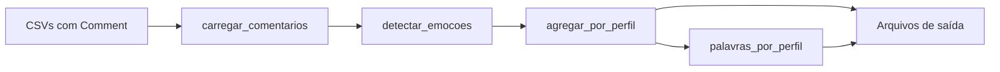

# Clusterização de dados do Reddit

Complemento para projetos de scraping do Reddit (ex.: [PRAW](https://praw.readthedocs.io/)). Este repositório **não faz scraping** — ele recebe CSVs com comentários, classifica cada um em um **perfil emocional** e gera relatórios prontos para análise ou uso com LLMs (ChatGPT, etc.).

## O que o projeto faz

1. **Carrega** todos os `.csv` de uma pasta que tenham a coluna `Comment`
2. **Classifica** cada comentário em um dos 4 perfis emocionais (modelo zero-shot BART)
3. **Agrupa** os resultados por perfil (a clusterização oficial é emocional, não lexical)
4. **Extrai** termos frequentes por perfil (TF-IDF)
5. **Gera** CSV, estatísticas, resumo em texto e arquivo de palavras-chave



## Perfis emocionais

Cada comentário recebe exatamente um rótulo:

| Perfil | Descrição (uso na classificação) |
|--------|----------------------------------|
| **Cético Racional** | Abordagem analítica, ceticismo |
| **Perdido Espiritual** | Busca espiritual, incerteza existencial |
| **Curioso Cético** | Curiosidade com reservas |
| **Impulsivo Esperançoso** | Otimismo, reação impulsiva |

O modelo usado é [`facebook/bart-large-mnli`](https://huggingface.co/facebook/bart-large-mnli) (zero-shot classification). Na primeira execução o peso do modelo (~1,6 GB) é baixado automaticamente pelo Hugging Face.

## Estrutura do repositório

```
.
├── analise_core.py      # Pipeline principal (compartilhado)
├── analise.py           # Script CLI para rodar localmente
├── analisecolab.ipynb   # Notebook para Google Colab (GPU)
├── requirements.txt     # Dependências Python
├── csv/                 # Exemplo: pasta com seus CSVs (opcional)
└── README.md
```

| Arquivo | Função |
|---------|--------|
| `analise_core.py` | Lógica única: carregar dados, classificar, TF-IDF, salvar saídas |
| `analise.py` | Interface de linha de comando (`--pasta`, `--saida`, etc.) |
| `analisecolab.ipynb` | Mesmo pipeline no Colab, com upload/download de arquivos |

## Requisitos

- Python 3.10+ (testado em 3.13)
- ~2 GB de espaço em disco (modelo + cache)
- Recomendado: GPU para classificação mais rápida (opcional; funciona em CPU)

## Instalação

```bash
git clone https://github.com/SEU_USUARIO/Clusterizacao-de-dados-do-reddit-scraping.git
cd Clusterizacao-de-dados-do-reddit-scraping

pip install -r requirements.txt
```

Dependências principais: `pandas`, `scikit-learn`, `transformers`, `torch`, `tqdm`.

## Formato dos CSVs de entrada

O pipeline procura arquivos `*.csv` na pasta informada e **ignora** arquivos sem a coluna `Comment`.

**Obrigatório**

| Coluna | Descrição |
|--------|-----------|
| `Comment` | Texto do comentário |

**Opcionais** (enriquecem o resumo se existirem)

| Coluna | Alias aceito |
|--------|----------------|
| `Author` | `Comment Author` |
| `Subreddit` | — |
| `Post` | — |
| `Score` | — |

Exemplo mínimo (export do scraper):

```csv
Comment,Comment Author,Comment Timestamp
"Texto do comentário...",usuario123,2024-01-15
```

> Arquivos só com metadados de posts (ex.: `Title`, `URL` sem `Comment`) são ignorados automaticamente.

## Uso local

```bash
python analise.py --pasta "./csv" --saida .
```

### Opções da CLI

| Argumento | Padrão | Descrição |
|-----------|--------|-----------|
| `--pasta` | `.` ou `REDDIT_CSV_PASTA` | Pasta com os CSVs |
| `--saida` | `.` | Onde salvar os resultados |
| `--idioma` | `both` | Stop words NLTK: `both` (EN+PT), `en`, `pt` ou `none` |
| `--min-palavras` | `3` | Ignora comentários com menos palavras (após remover URLs) |
| `--manter-curtos` | — | Não exclui textos curtos nem links puros |
| `--sem-duplicatas` | — | Remove comentários repetidos |
| `--cache` | `cache_emocoes.json` | Arquivo de cache das classificações |
| `--sem-cache` | — | Reclassifica tudo do zero |
| `--batch-size` | `8` | Comentários por lote na inferência |

**Exemplos**

```bash
# Só stop words em inglês
python analise.py --pasta "./csv" --saida . --idioma en

# Incluir comentários curtos e links (comportamento antigo)
python analise.py --pasta "./csv" --saida . --manter-curtos

# GPU / mais RAM: lotes maiores
python analise.py --pasta "./csv" --batch-size 16

# Variável de ambiente para a pasta padrão
set REDDIT_CSV_PASTA=C:\caminho\para\csvs
python analise.py --saida .
```

**Atenção no PowerShell:** deixe espaço entre o flag e o valor — use `--saida .` e não `--saida.`

### Tempo de execução

- **Primeira vez:** download do modelo + classificação (~vários minutos em CPU para centenas de comentários)
- **Reexecuções:** o cache (`cache_emocoes.json`) evita reclassificar textos já processados; as etapas seguintes levam segundos

## Uso no Google Colab

1. Abra `analisecolab.ipynb` no [Google Colab](https://colab.research.google.com/)
2. Execute a célula de `pip install`
3. Faça upload dos **CSVs** e do arquivo **`analise_core.py`**
4. Execute as células do pipeline (runtime com GPU acelera bastante)
5. Baixe os arquivos gerados na última célula

No Colab, use `batch_size=16` (ou maior) se a GPU estiver ativa.

## Arquivos gerados

| Arquivo | Conteúdo |
|---------|----------|
| `saida_analise_chatgpt.csv` | Todos os comentários + `perfil_emocional`, `score_emocional`, `svd_x`, `svd_y` |
| `estatisticas_perfis.csv` | Quantidade e % por perfil |
| `palavras_por_perfil.txt` | Top termos TF-IDF por perfil (sem artigos/pronomes comuns) |
| `resumo_perfis_chatgpt.txt` | Resumo estruturado (estatísticas, termos, exemplos) para colar em um LLM |
| `comentarios_excluidos.csv` | Textos curtos ou só link, não classificados emocionalmente |
| `cache_emocoes.json` | Cache das classificações (gerado automaticamente) |

### Colunas do CSV principal

| Coluna | Significado |
|--------|-------------|
| `comentario` | Texto original |
| `perfil_emocional` | Rótulo escolhido pelo modelo |
| `score_emocional` | Confiança do rótulo (0–1); útil para filtrar classificações fracas |
| `svd_x`, `svd_y` | Coordenadas 2D (TruncatedSVD) para visualização |
| `Author`, etc. | Repetidas do CSV de entrada, se existirem |

## Integração com o projeto de scraping (PRAW)

Fluxo sugerido:

1. **Projeto 1 (PRAW):** coleta posts/comentários → exporta CSV com coluna `Comment`
2. **Este projeto:** aponta `--pasta` para a pasta dos CSVs → gera perfis e resumos

Os dois repositórios são independentes; basta manter o mesmo formato de coluna `Comment`.

## Detalhes técnicos

- **Classificação:** inferência em batch, GPU automática se CUDA disponível, truncamento de textos longos (2000 caracteres)
- **Agrupamento:** por `perfil_emocional` (não há KMeans separado — evita confundir cluster lexical com perfil emocional)
- **TF-IDF / palavras por perfil:** stop words via [NLTK](https://www.nltk.org/) (inglês + português por padrão com `--idioma both`), mais termos de URL (`http`, `www`, etc.)
- **Filtro de ruído:** comentários com menos de 3 palavras ou apenas links vão para `comentarios_excluidos.csv` e não passam pela classificação emocional
- **Visualização:** redução dimensional com `TruncatedSVD` em matriz esparsa (eficiente em memória)

## O que não commitar no GitHub

Adicione um `.gitignore` com entradas como:

```
cache_emocoes.json
__pycache__/
*.pyc
.env
csv/*.csv
saida_analise_chatgpt.csv
estatisticas_perfis.csv
palavras_por_perfil.txt
resumo_perfis_chatgpt.txt
```

Assim você evita subir cache grande, dados pessoais dos CSVs e saídas geradas.

## Solução de problemas

| Erro | Causa | Solução |
|------|--------|---------|
| `unrecognized arguments: --saida.` | Ponto colado no flag | Use `--saida .` (com espaço) |
| `Nenhum arquivo com a coluna 'Comment'` | CSVs sem comentários | Use export com `Comment`; ignore CSVs só de posts |
| `InvalidParameterError ... portuguese` | Versão antiga do código | Atualize `analise_core.py` (já corrigido com lista PT customizada) |
| `ModuleNotFoundError: torch` | Dependências faltando | `pip install -r requirements.txt` |
| Muito lento na primeira vez | Modelo grande em CPU | Use Colab com GPU ou reexecute com cache |

## Licença

Defina a licença desejada (ex.: MIT) antes de publicar, se ainda não houver um arquivo `LICENSE`.

## Autor

Projeto de análise e clusterização emocional de comentários do Reddit — complemento ao scraping com PRAW.
